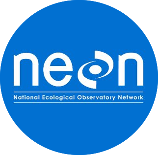

[](https://circleci.com/gh/cyverse-gis/neon-shiny-browser) [](https://opensource.org/licenses/GPL-3.0) [](https://www.cyverse.org) [](https://www.repostatus.org/#active)  [](https://doi.org/10.5281/zenodo.3405600)

[](https://hub.docker.com/r/cyversevice/shiny-geospatial/neon-shiny-browser) [](https://hub.docker.com/r/cyversevice/shiny-geospatial) [](https://hub.docker.com/r/cyversevice/shiny-neon-browser/builds) 

# NEON-Shiny-Browser

A multifunctional R Shiny map and data API download tool. Designed to make NEON API data accessible in RStudio. This version is meant to be deployed locally, on your own computer or virtual machine. The [CyVerse NEON Browser](https://github.com/cyverse-gis/CyVerse-NEON-Browser) can be used in the CyVerse [Discover Environment](https://de.cyverse.org) to download NEON data to your CyVerse Data Store. 

The app can be run in RStudio or RStudio-Server (online).

## Version 1.1 - Major Update 🎉

**Version 1.1** includes significant modernization updates:

- ✅ **R 4.4+ Support**: Updated from R 3.6.3 to modern R versions
- 🔐 **HTTPS Security**: All API calls now use secure HTTPS endpoints  
- 🔑 **API Token Support**: Optional NEON API tokens for faster downloads
- 🆕 **Modern Dependencies**: Replaced deprecated `nneo` package with current `neonUtilities` functions
- 🧪 **Comprehensive Testing**: Added extensive test suite with 600+ lines of test code
- 🐳 **Updated Docker**: Modern container with R 4.4 and spatial packages

### API Token Support (New!)

Get faster download speeds by using your NEON API token:
1. Create account at [data.neonscience.org](https://data.neonscience.org/myaccount)
2. Generate API token from "My Account" page
3. Enter token in the app's download section (optional but recommended)

## Overview

The NEON Shiny Browser is an interactive tool to browse, pull, and manipulate data collected by [NEON](https://www.neonscience.org/). This R Shiny app uses [leaflet](https://leafletjs.com/) and [neonUtilities](https://github.com/NEONScience/NEON-utilities/tree/master/neonUtilities) to create a comprehensive tool that allows users to do everything from browsing NEON sites, to finding and downloading and unzipping data products.

### Features

First, this app displays relevant features of NEON and their research on a map. Users can view and filter map features such as NEON [sites](https://www.neonscience.org/field-sites), NEON domains, [AOP](https://www.neonscience.org/data-collection/airborne-remote-sensing) flightpaths, and [TOS](https://www.neonscience.org/data-collection/terrestrial-organismal-sampling) locations.

<p align="center"></p>

Additionally, this app provides an easy, in-app alternative to NEON's [data portal](http://data.neonscience.org/browse-data). Users can browse data products, view their details (e.g. description, abstract, availability), and easily download them to their computer.

<p align="center"></p>

### Goal

The goal of this app is to simplify the NEON experience and introduce NEON's services in a simple platform that can be useful for newcomers and experienced users alike. While the <a href='https://www.neonscience.org/' target='_blank'>NEON website</a> will always be the ultimate destination for information, opportunities, or more advanced requests, this application is a functional tool meant to satisfy basic interactions with NEON services. Specifically, the app's unified platform hopes to simplify the NEON experience by aggregating many of the more advanced features and making them accessible to those without the time or the programming experience. For example, all downloads come stacked, meaning that the data products arrive already unzipped, joined, and grouped by table type. While one could download from the <a href='http://data.neonscience.org/home' target='_blank'>NEON Data Portal</a>, and then use an R package to apply the same process to their downloads, that requires multiple steps and some basic knowledge of programming and R; the NEON Shiny Browser, on the other hand, does this automatically, saving time and learning for those who want it. Similarly, a visit to the NEON website yields a data browser and interactive map in different locations (and entirely separate domains), making it potentially confusing for a newcomer to grasp the basics of NEON and be able to find all the services that augment NEON data. This tool, conversely, combines basic approximations of the map and data browser, offering similar information and capabilities from one contained platform. Through these measures, the NEON Shiny Browser hopes to act as a complement to the structure that NEON has already created, increasing its reach and impact in the world of ecology and beyond.

## NEON

The National Ecological Observatory Network <a href="https://www.neonscience.org/"></a> is a "continental-scale ecological observation facility" that provides open data on our ecosystems. The envisioned 30-year project collects environmental data like precipitation, soil temperature, humidity, and pressure across 81 field sites (47 terrestrial and 34 aquatic) to measure the patterns and changes in our environment. With over 180 data products describing the characteristics of a diverse range of ecosystems, their data will be crucial to future studies of biology and climate change over time.

## Installation

### Requirements

- **R 4.0 or higher** (R 4.4+ recommended)
- Internet connection for NEON API access
- Modern web browser with pop-ups enabled

### Quick Start

To install and run the tool:

```bash
$ cd
$ git clone -b v1.1 https://github.com/cyverse-gis/neon-shiny-browser
$ cd ~/neon-shiny-browser
$ R
```

In R:
```r
# Install dependencies (automatically checks R version)
source("Install.R")

# Launch the app
setwd('~/neon-shiny-browser')
library(shiny)
runApp()
```

### Run App in RStudio or RStudio-Server 

Start RStudio or RStudio server, and in the Console:

```r
setwd('~/neon-shiny-browser')
source("Install.R")  # Install/update dependencies
library(shiny)
runApp()
```

The app will automatically install any missing dependencies. You may need to install additional system dependencies for spatial packages (see [Linux section](#linux) below).

**Important:** You must allow pop-ups in your Browser for the app to open

### Run App as a background process (preferred method)

Running a Shiny App in your R console will lock the console and prevent you from doing other work in RStudio while the app is running. You can run this app as a background process using the RStudio "Jobs" tab

Create a `background.R` script or use the one in this repo. Start a new Job running the script. After the app downloads its dependencies and starts, you'll see that it is running and listening on a randomly assigned local port: ```Listening on http://127.0.0.1:4199```

In this example, the app is on port `4199`

In the R Console, type:
```r
rstudioapi::viewer("http://localhost:4199")
```

The App will open in the lower right corner of RStudio in the Viewer pane. You can pop-out the viewer and it will open as its own browser tab.

## Run with Docker

Run Docker locally or on a Virtual Machine

### Pull Container from Docker Hub

To run the Shiny-Server, you must first `pull` the container from Docker Hub

```bash
docker pull cyversevice/shiny-neon-browser:latest
```

Create a directory called `NEON_Downloads`, suggest in your user's home directory:
```bash
mkdir ~/NEON_Downloads
```

Run the container image: 
```bash
docker run -it --rm -p 3838:3838 -e REDIRECT_URL=http://localhost:3838 -v ${HOME}/NEON_Downloads:/srv/shiny-server/NEON_Downloads cyversevice/shiny-neon-browser:latest
```

The app will open in your browser at `http://localhost:3838`

**Important:** The data are not downloaded to your computer if you do not mount a volume `-v` into the Docker container when it is run

If you're running on a remote server, you can change `localhost` to your IP address or DNS. 

### Build Container yourself

To build the Docker container locally:

```bash
cd
git clone -b v1.1 https://github.com/cyverse-gis/neon-shiny-browser
cd neon-shiny-browser
sudo docker build -t shiny-neon-browser:latest .
```

## Testing

### Run Test Suite (New in v1.1!)

To run the comprehensive test suite:

```r
# Run all tests
source("run_tests.R")

# Or run individual test categories
library(testthat)
test_file("tests/testthat/test-neonUtilities-replacements.R")  # API functions
test_file("tests/testthat/test-app-functionality.R")          # App behavior  
test_file("tests/testthat/test-download-integration.R")       # Download workflow
```

See `TESTING.md` for detailed testing documentation.

## Requirements & Dependencies

### Core Packages

The app automatically installs these packages via `Install.R`:

- **Shiny ecosystem**: `shiny`, `shinythemes`, `shinyWidgets`, `shinyBS`, `shinyjs`
- **Mapping**: `leaflet`, `leaflet.extras` 
- **NEON data**: `neonUtilities` (2.0+)
- **Spatial**: `sf`, `geosphere`
- **Data processing**: `jsonlite`, `dplyr`, `DT`
- **HTTP**: `crul`, `httr`
- **Testing**: `testthat`

### Linux

While we suggest using our [CyVerse](https://hub.docker.com/r/cyversevice/rstudio-geospatial) docker image or the original [Rocker Project Geospatial](https://hub.docker.com/r/rocker/geospatial) image, if you want to attempt a local installation of the geospatial packages in linux, you can install the following (example for Debian or Ubuntu):

```bash
sudo apt-get update 
sudo apt-get install -y --no-install-recommends \
    lbzip2 \
    libfftw3-dev \
    libgdal-dev \
    libgeos-dev \
    libgsl0-dev \
    libgl1-mesa-dev \
    libglu1-mesa-dev \
    libhdf4-alt-dev \
    libhdf5-dev \
    libjq-dev \
    liblwgeom-dev \
    libpq-dev \
    libproj-dev \
    libprotobuf-dev \
    libnetcdf-dev \
    libsqlite3-dev \
    libssl-dev \
    libudunits2-dev \
    netcdf-bin \
    postgis \
    protobuf-compiler \
    sqlite3 \
    tk-dev \
    unixodbc-dev
```

Then start R and run:
```r
source("Install.R")
```

**Note: [Mac OS X](https://cran.r-project.org/bin/macosx/tools/) currently requires that `gfortran` and `clang` be installed in addition to the latest version of R (> v4.0)** 

## What's New in v1.1

### Major Technical Updates

- **Modernized R Environment**: Updated from R 3.6.3 to R 4.4+ with modern package dependencies
- **Security Improvements**: All API calls upgraded from HTTP to HTTPS 
- **API Authentication**: Added support for NEON API tokens for faster download speeds
- **Replaced Deprecated Code**: Removed deprecated `nneo` package, replaced with current `neonUtilities` functions
- **Docker Modernization**: Updated to `rocker/shiny-verse:4.4` base image

### New Features

- **API Token Input**: Optional password field in download sections for faster access
- **Automated Spatial Data Management**: Automatically downloads and caches latest NEON spatial datasets (field boundaries, TOS plots, domains, flight boundaries, watersheds)
- **Spatial Data UI**: New "Spatial Data" tab for managing cached spatial datasets with update controls
- **Better Error Handling**: More informative error messages and network resilience
- **Comprehensive Test Suite**: 600+ lines of automated tests for reliability
- **Modern Dependencies**: Updated all packages to current versions

### Backward Compatibility

All existing functionality is preserved:
- Same UI and user experience
- Same download workflows 
- Same data output formats
- Same Docker deployment options

## Troubleshooting

### Common Issues

- **"R version too old"**: Update to R 4.0 or higher
- **"Cannot reach NEON API"**: Check internet connection, NEON API may be temporarily unavailable
- **Slow loading**: First load may be slower as it fetches fresh data; consider getting an API token
- **Package installation errors**: Make sure you have the required system dependencies (see Linux section)

### Performance Tips

1. **Get API Token**: Register at [data.neonscience.org](https://data.neonscience.org) for faster API access
2. **Use Stable Network**: Ensure good internet connection for API calls
3. **Update Regularly**: Keep R and packages current with `source("Install.R")`

## Documentation

- **`TESTING.md`**: Comprehensive testing guide
- **`UPDATES_SUMMARY.md`**: Detailed changelog for v1.1
- **`CLAUDE.md`**: Development and deployment instructions

## Contributing

We welcome contributions! Please:

1. Fork the repository
2. Create a feature branch
3. Make changes and add tests
4. Run the test suite: `source("run_tests.R")`
5. Submit a pull request

## FEEDBACK

This app is actively maintained and developed. The original developer was [Daniel Lee](https://github.com/Danielslee51), intern at [CyVerse](http://www.cyverse.org/). 

For issues, suggestions, or feedback:
- **Create an Issue** on GitHub for bugs or feature requests
- **Contact** [Tyson L. Swetnam](https://github.com/tyson-swetnam) for collaboration inquiries

We'd love to hear from scientists and researchers who use the app - your feedback helps us improve the tool for the community!