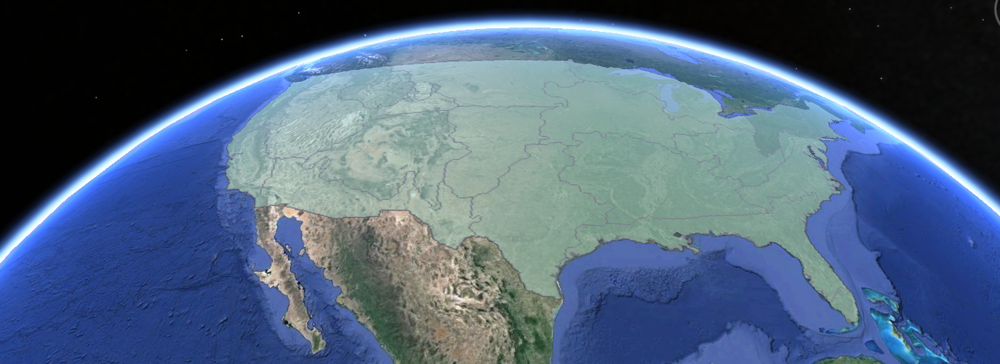
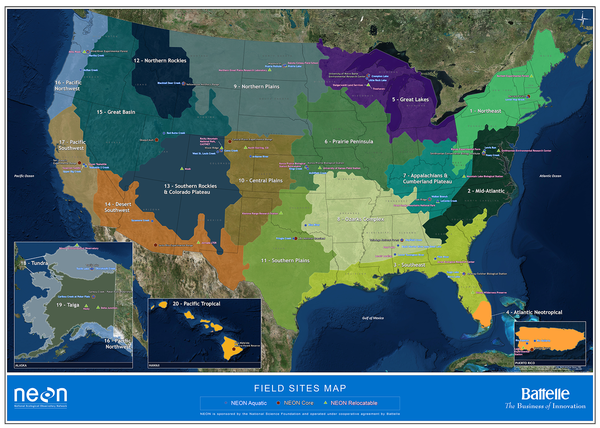
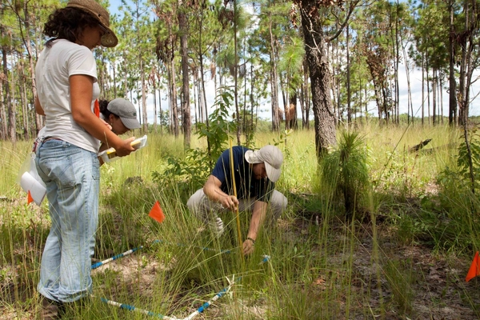

### Spatiotemporal Design

Quantifying ecological processes over time and across the continent requires a complex spatiotemporal sampling design. To characterize ecological change and uniquely support studies that link individual local measurements to site-level and continental-scale questions about ecological change, the Observatory:

* Strategically locates sites across the U.S. to capture variability in ecological and climatological conditions;

* Collects data that monitor and record conditions at varying time scales. For example, NEON collects stream flow data per minute; these data are used to derive daily and monthly stream flow averages;

* Coordinates local measurements in the field with high-resolution airborne remote sensing. These data may be further integrated with existing continental-scale datasets; and

* Provide resources for the ecological community to integrate observations and datasets independently, such as collection and processing protocols.

#### NEON strategically locates sites to capture ecological variability
The National Network Design Committee, in collaboration with the National Science Foundation, developed NEON’s ecoclimatic domain approach to strategically determine site locations representative of ecological and climatological conditions. NEON statistically partitioned the continental US, Hawaii and Puerto Rico into 20 ecoclimatic domains that represent distinct regions of vegetation, landforms and ecosystem dynamics to capture the full range of US ecological and climatic diversity. NEON selected ecologically representative core sites within each domain considering logistical convenience and site accessibility. In each domain, NEON collects data about plants, animals, soil, nutrients, freshwater and the atmosphere using sensor measurements and field observations.

#### NEON sites: fixed to capture wildland conditions and movable to capture human impacts on the environment
Within each domain, NEON operates core and relocatable sites. Each site collects either aquatic or terrestrial data as follows:

#### Core sites
Core sites are fixed, collect data for a minimum of 30 years and are designed to represent and capture wildland conditions. NEON operates 20 [core terrestrial sites](https://www.neonscience.org/field-sites/types-neon-field-sites) across 20 domains and 20 [core aquatic sites](https://www.neonscience.org/field-sites/types-neon-field-sites) across 19 domains. When logistically possible, aquatic and terrestrial core sites are colocated to support understanding of linkages across atmospheric, terrestrial and aquatic ecosystems. NEON generally places one core terrestrial and one core aquatic site in each domain to statistically capture wildland conditions across the continent. Core sites form a baseline of observation in wildland systems. They are primary locations for long-term studies of climate impacts and reference sites for studies of ecological change, particularly related to relocatable sites. Core site location criteria include:
* Representation of wildland conditions in respective ecoclimatic domains;

* Proximity to relocatable sites for logistical convenience;

* Long-term accessibility via permitting and secure land tenure; and

* Availability for regular air survey with unimpeded air space, if possible.

#### Relocatable sites
Relocatable sites move through time to capture environmental gradients not captured at core sites; these sites are intended to support the study of key continental areas of study, such as nitrogen deposition change. NEON will operate a total of 27 relocatable terrestrial sites and 14 relocatable aquatic sites that are re-deployed periodically throughout the 30-year timeframe of the Observatory. The Observatory will move relocatable sites periodically to address the Grand Challenges in Environmental Science and other environmental gradients by surveying contrasting areas of environmental change. Site location criteria include:

* Location in an area subject to ecological phenomena, specifically relevant to the Grand Challenges;

* Proximity to core sites for logistical convenience; and

* Comparability to nearby core sites, which provide wildland baseline information.

#### Measurements at Multiple Scales
Scaling information from NEON sites to the continent presents considerable challenges that must be addressed through systematic sampling within a framework of multi-scaled observations, analysis and modeling. NEON provides opportunities to integrate local to continental-scale measurements that characterize ecological change. For example, NEON 1) measures individual trees at sites and 2) collects remote sensing data that characterize trees and forests over multiple sites. Scientists can integrate these measurements with existing nationwide datasets, such as satellite derived land cover data. Combined, these data provide a continental view of carbon flux and vegetation cover over time.

#### Field-based measurements
At each site, NEON collects [biological, chemical and physical measurements and samples](https://www.neonscience.org/science-design/collection-methods), using manual field measurements and calibrated sensors. NEON produces data products that characterize site-level conditions at varying spatial and temporal resolutions. For example, field technicians collect vegetation data that identifies individual tree species and measures vegetation height and density within particular plots. Collected over time, this information can be used to track changes in vegetation structure and composition. NEON site-level observations also offer direct measurements of the ecosystem exchange of energy, water and carbon at small spatial scales. Site-level estimates of water and carbon fluxes drive models that characterize and predict the responses of global biogeochemical cycles to changing climate and land cover.

#### Airborne remote sensing data
NEON uses [sensors mounted on an airplane](https://www.neonscience.org/data-collection/airborne-remote-sensing) to collect data that characterizes ecological conditions continuously, over the entire area of its field sites. These airborne data, combined with site-level measurements that often represent smaller plots, can be used to estimate vegetation height, density, health and even leaf chemistry across entire NEON sites and regions. These site-level NEON data products support the study of ecological change across disparate ecosystems throughout the United States. Learn more about NEON's spatiotemporal design [here](https://www.neonscience.org/observatory/about/spatiotemporal-design.

#### Supporting continental-scale ecological science
NEON is designed to provide a unique and unprecedented set of continental-scale data products that characterize ecological processes. The strategic placement of [NEON sites across the U.S.](https://www.neonscience.org/science-design/field-sites) provides detailed data collected in the field and through airborne remote sensing. Scientists may advance the understanding of the drivers and impacts of ecological change by further integrating NEON data with external datasets. For example, NEON data may be combined with existing satellite data to support characterization of ecological processes, such as the balance of carbon dioxide exchange between vegetation and the atmosphere through photosynthesis and respiration. This process requires advanced mathematical and spatial models that use lower resolution information from satellites to validate and enhance NEON data.
